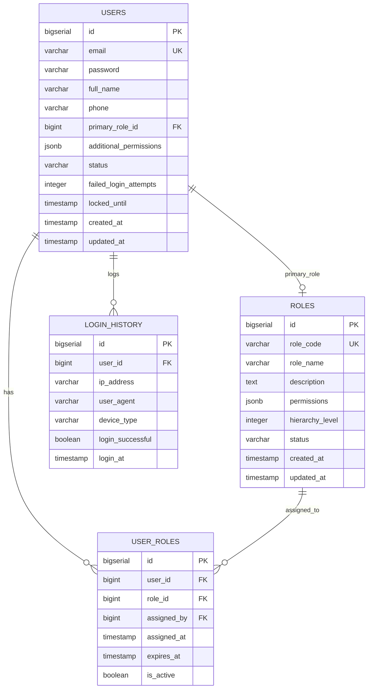
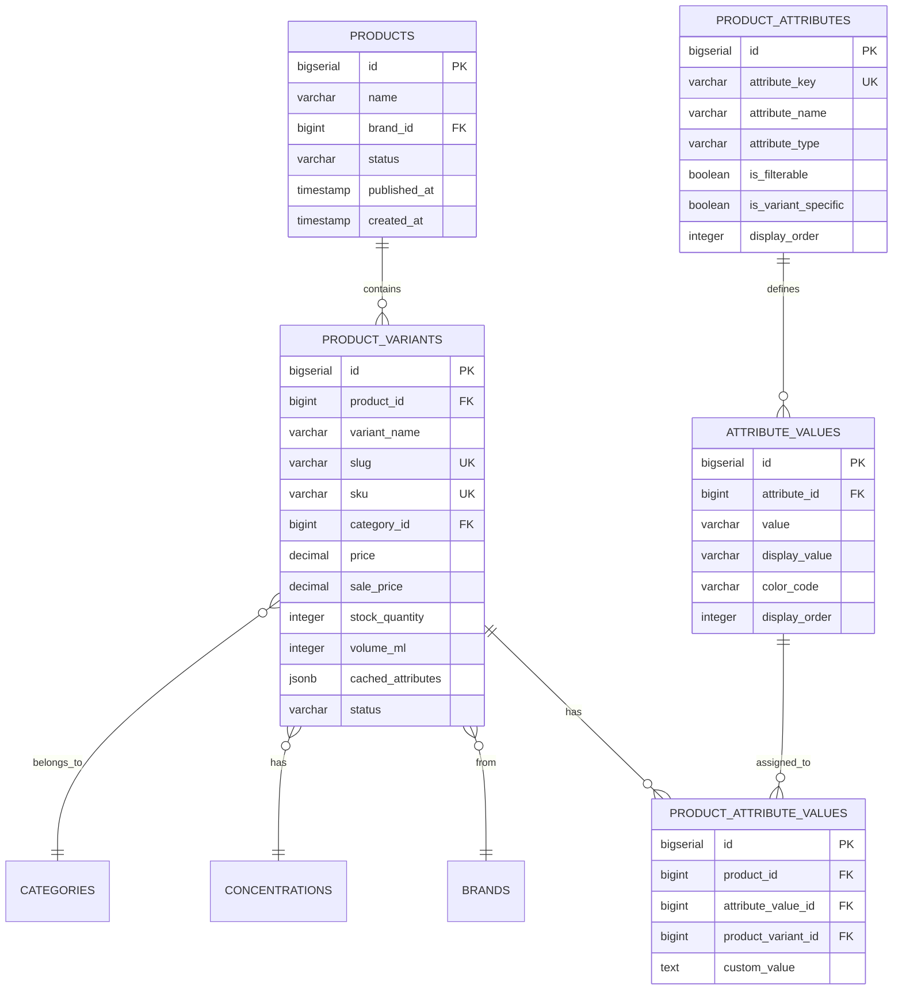
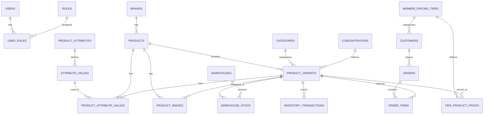

# 🗄️ Database Schema - Orchard Store Backend

> **PostgreSQL 16 với RBAC + Hybrid EAV Pattern**

---

## 📚 Table of Contents

1. [Overview](#overview)
2. [RBAC System](#rbac-system)
3. [Product Catalog (Hybrid EAV)](#product-catalog-hybrid-eav)
4. [Supporting Tables](#supporting-tables)
5. [Image Management](#image-management)
6. [Product Media & Translations](#product-media--translations)
7. [Indexing Strategy](#indexing-strategy)
8. [JSONB Usage](#jsonb-usage)

---

## 🎯 Overview

### Database Technology

- **Database:** PostgreSQL 16 (Supabase Cloud)
- **Migration Tool:** Flyway (Version control for database)
- **ORM:** Hibernate 6.3 (via Spring Data JPA)
- **Special Features:** JSONB, GIN Indexes, Generated Columns

### Schema Highlights

- **RBAC (Role-Based Access Control):** Flexible permission system với hierarchy levels
- **Hybrid EAV (Entity-Attribute-Value):** Dynamic product attributes + JSONB caching
- **JSONB Optimization:** Store flexible data, query với native PostgreSQL
- **GIN Indexes:** Fast search trên JSONB columns
- **Audit Trail:** created_by, updated_by, created_at, updated_at
- **Soft Delete:** Sử dụng status thay vì xóa hẳn

---

## 🔐 RBAC System (Authentication & Authorization)

### ER Diagram



### Table Details

#### 1. `users` Table

**Purpose:** Store user accounts (Admin, Staff)

```sql
CREATE TABLE users (
    id BIGSERIAL PRIMARY KEY,
    email VARCHAR(255) UNIQUE NOT NULL,
    password VARCHAR(255) NOT NULL,              -- BCrypt hashed
    full_name VARCHAR(255),
    phone VARCHAR(20),
    role VARCHAR(20) DEFAULT 'ADMIN',            -- Legacy field
    primary_role_id BIGINT,                      -- FK to roles
    additional_permissions JSONB DEFAULT '{}'::jsonb,  -- Override permissions
    status VARCHAR(20) DEFAULT 'ACTIVE',         -- ACTIVE | INACTIVE | BANNED | SUSPENDED
    failed_login_attempts INTEGER DEFAULT 0,
    locked_until TIMESTAMP,                      -- Account lock (5 failed → 30min)
    password_changed_at TIMESTAMP,
    last_password_reset_request TIMESTAMP,
    last_login TIMESTAMP,
    last_login_ip VARCHAR(45),
    notes TEXT,
    created_at TIMESTAMP DEFAULT CURRENT_TIMESTAMP,
    updated_at TIMESTAMP DEFAULT CURRENT_TIMESTAMP
);

-- Indexes
CREATE INDEX idx_users_email ON users(email);
CREATE INDEX idx_users_status ON users(status);
CREATE INDEX idx_users_primary_role ON users(primary_role_id);
CREATE INDEX idx_users_additional_permissions ON users USING GIN (additional_permissions);
CREATE INDEX idx_users_locked ON users(locked_until) WHERE locked_until IS NOT NULL;
```

**Key Features:**

- ✅ Unique email (login identifier)
- ✅ BCrypt password (strength 10)
- ✅ JSONB additional_permissions (override role permissions)
- ✅ Failed login tracking (auto lock after 5 attempts)
- ✅ GIN index cho JSONB permissions

#### 2. `roles` Table

**Purpose:** Define roles với hierarchy levels và permissions

```sql
CREATE TABLE roles (
    id BIGSERIAL PRIMARY KEY,
    role_code VARCHAR(50) UNIQUE NOT NULL,       -- SUPER_ADMIN, ADMIN, MANAGER...
    role_name VARCHAR(100) NOT NULL,
    description TEXT,
    permissions JSONB DEFAULT '{}'::jsonb,        -- { "products": ["*"], "orders": ["read", "update"] }
    hierarchy_level INTEGER DEFAULT 1,           -- 1-10 (10 = highest)
    status VARCHAR(20) DEFAULT 'ACTIVE',
    created_at TIMESTAMP DEFAULT CURRENT_TIMESTAMP,
    updated_at TIMESTAMP DEFAULT CURRENT_TIMESTAMP,
    CHECK (hierarchy_level >= 1 AND hierarchy_level <= 10)
);

-- Indexes
CREATE INDEX idx_roles_code ON roles(role_code);
CREATE INDEX idx_roles_hierarchy ON roles(hierarchy_level);
CREATE INDEX idx_roles_permissions ON roles USING GIN (permissions);  -- ⭐ GIN Index
```

**Default Roles:**

| Role Code     | Name                | Level | Permissions                 |
| ------------- | ------------------- | ----- | --------------------------- |
| `SUPER_ADMIN` | Super Administrator | 10    | `{"*": ["*"]}` (All)        |
| `ADMIN`       | Administrator       | 9     | All modules except system   |
| `MANAGER`     | Manager             | 7     | Products, Orders, Analytics |
| `STAFF`       | Staff               | 5     | Orders, Limited products    |
| `VIEWER`      | Viewer              | 3     | Read-only                   |

**Hierarchy Rules:**

```java
// User with level 9 (ADMIN) can manage users with level ≤ 8
// User cannot manage users with same level (9 = 9)
if (currentUserMaxLevel > targetUserMaxLevel) {
    // Allowed
}
```

#### 3. `user_roles` Table (Many-to-Many)

**Purpose:** Link users với roles (a user can have multiple roles)

```sql
CREATE TABLE user_roles (
    id BIGSERIAL PRIMARY KEY,
    user_id BIGINT NOT NULL,
    role_id BIGINT NOT NULL,
    assigned_by BIGINT,                          -- Who assigned this role
    assigned_at TIMESTAMP DEFAULT CURRENT_TIMESTAMP,
    expires_at TIMESTAMP,                        -- Optional expiry
    is_active BOOLEAN DEFAULT TRUE,
    UNIQUE(user_id, role_id)
);

-- Indexes
CREATE INDEX idx_user_roles_user ON user_roles(user_id);
CREATE INDEX idx_user_roles_role ON user_roles(role_id);
CREATE INDEX idx_user_roles_active ON user_roles(user_id, is_active) WHERE is_active = true;
```

**Key Features:**

- ✅ Tracking: Who assigned role, when
- ✅ Expiry: Temporary role assignments
- ✅ Active status: Soft deactivate roles
- ✅ Partial index: Only active roles

#### 4. `login_history` Table

**Purpose:** Track all login attempts (success & failed)

```sql
CREATE TABLE login_history (
    id BIGSERIAL PRIMARY KEY,
    user_id BIGINT,
    email VARCHAR(255) NOT NULL,
    ip_address VARCHAR(45),
    user_agent TEXT,
    device_type VARCHAR(50),
    login_successful BOOLEAN NOT NULL,
    failure_reason VARCHAR(255),
    login_at TIMESTAMP DEFAULT CURRENT_TIMESTAMP
);

-- Indexes
CREATE INDEX idx_login_history_user ON login_history(user_id);
CREATE INDEX idx_login_history_email ON login_history(email);
CREATE INDEX idx_login_history_time ON login_history(login_at DESC);
```

---

## 📦 Product Catalog (Hybrid EAV)

### Why Hybrid EAV?

**Problem:** Products have different attributes

- Nước ép: Volume (ml), Concentration (%)
- Táo: Weight (kg), Origin country
- Coffee: Roast level, Grind size

**Solution:** Hybrid approach

- **Fixed fields** in `products` & `product_variants` (name, price, stock...)
- **Dynamic attributes** in EAV tables (color, size, origin...)
- **JSONB caching** in `cached_attributes` (for fast queries)

### ER Diagram



### Table Details

#### 1. `products` Table (Base Product)

**Purpose:** Base product information (before variants)

```sql
CREATE TABLE products (
    id BIGSERIAL PRIMARY KEY,
    name VARCHAR(255) NOT NULL,
    brand_id BIGINT NOT NULL,
    status VARCHAR(20) DEFAULT 'DRAFT',          -- DRAFT | UNDER_REVIEW | ACTIVE | INACTIVE | ARCHIVED
    published_at TIMESTAMP,
    archived_at TIMESTAMP,
    created_by BIGINT,
    updated_by BIGINT,
    created_at TIMESTAMP DEFAULT CURRENT_TIMESTAMP,
    updated_at TIMESTAMP DEFAULT CURRENT_TIMESTAMP
);

CREATE INDEX idx_products_brand_status ON products(brand_id, status);
CREATE INDEX idx_products_published ON products(published_at) WHERE status = 'ACTIVE';
```

**Example:**

- Product: "Nước ép táo Mỹ" (Base product)
  - Variant 1: 500ml
  - Variant 2: 1000ml

#### 2. `product_variants` Table ⭐ (Hybrid EAV Core)

**Purpose:** Actual sellable items (SKU variants)

```sql
CREATE TABLE product_variants (
    id BIGSERIAL PRIMARY KEY,
    product_id BIGINT NOT NULL,
    variant_name VARCHAR(255) NOT NULL,
    slug VARCHAR(255) UNIQUE NOT NULL,
    sku VARCHAR(100) UNIQUE NOT NULL,            -- Stock Keeping Unit
    barcode VARCHAR(100),

    -- Relationships
    category_id BIGINT,
    concentration_id BIGINT,

    -- Pricing
    price DECIMAL(15,2) NOT NULL,
    sale_price DECIMAL(15,2),
    cost_price DECIMAL(15,2),
    currency_code VARCHAR(3) DEFAULT 'VND',

    -- Inventory
    stock_quantity INTEGER DEFAULT 0,
    reserved_quantity INTEGER DEFAULT 0,
    low_stock_threshold INTEGER DEFAULT 10,
    manage_inventory BOOLEAN DEFAULT TRUE,
    stock_status VARCHAR(20) DEFAULT 'IN_STOCK',

    -- Physical Attributes
    volume_ml INTEGER,
    volume_unit VARCHAR(10) DEFAULT 'ml',
    weight_grams DECIMAL(8,2),
    weight_unit VARCHAR(10) DEFAULT 'g',

    -- Descriptions
    short_description TEXT,
    full_description TEXT,
    meta_title VARCHAR(255),
    meta_description TEXT,

    -- ⭐ JSONB Cached Attributes (Performance Optimization)
    cached_attributes JSONB DEFAULT '{}'::jsonb,  -- { "color": "red", "origin": "USA" }

    -- Metadata
    is_default BOOLEAN DEFAULT FALSE,
    status VARCHAR(20) DEFAULT 'ACTIVE',
    view_count INTEGER DEFAULT 0,
    sold_count INTEGER DEFAULT 0,
    created_at TIMESTAMP DEFAULT CURRENT_TIMESTAMP,
    updated_at TIMESTAMP DEFAULT CURRENT_TIMESTAMP
);

-- Standard Indexes
CREATE INDEX idx_variants_product ON product_variants(product_id);
CREATE INDEX idx_variants_sku ON product_variants(sku);
CREATE INDEX idx_variants_slug ON product_variants(slug);
CREATE INDEX idx_variants_category ON product_variants(category_id);
CREATE INDEX idx_variants_status ON product_variants(status);

-- ⭐ GIN Index for JSONB (Fast attribute search)
CREATE INDEX idx_variants_cached_attributes_gin
    ON product_variants USING GIN (cached_attributes);
```

**Why `cached_attributes`?**

Instead of:

```sql
-- Slow: Multiple JOINs
SELECT pv.* FROM product_variants pv
INNER JOIN product_attribute_values pav ON pav.product_variant_id = pv.id
INNER JOIN attribute_values av ON av.id = pav.attribute_value_id
INNER JOIN product_attributes pa ON pa.id = av.attribute_id
WHERE pa.attribute_key = 'color' AND av.value = 'red';
```

Use:

```sql
-- Fast: Single GIN index lookup
SELECT * FROM product_variants
WHERE cached_attributes @> '{"color": "red"}'::jsonb;
```

**Update cached_attributes:**

```java
// When attributes change:
variant.setCachedAttributes(Map.of(
    "color", "red",
    "origin", "USA",
    "organic", true
));
```

#### 3. `product_attributes` Table (EAV Schema)

**Purpose:** Define dynamic attributes (color, size, origin...)

```sql
CREATE TABLE product_attributes (
    id BIGSERIAL PRIMARY KEY,
    attribute_key VARCHAR(100) NOT NULL UNIQUE,  -- color, size, origin
    attribute_name VARCHAR(255) NOT NULL,        -- Màu sắc, Kích thước
    attribute_name_en VARCHAR(255),              -- Color, Size
    attribute_type VARCHAR(50) NOT NULL,         -- SELECT | MULTISELECT | RANGE | BOOLEAN | TEXT
    data_type VARCHAR(50) DEFAULT 'STRING',
    is_filterable BOOLEAN DEFAULT TRUE,          -- Show in filter UI?
    is_searchable BOOLEAN DEFAULT FALSE,         -- Index for search?
    is_required BOOLEAN DEFAULT FALSE,
    is_variant_specific BOOLEAN DEFAULT FALSE,   -- Different per variant?
    display_order INTEGER DEFAULT 0,
    icon_class VARCHAR(100),
    color_code VARCHAR(7),
    validation_rules JSONB,                      -- { "min": 0, "max": 100 }
    description TEXT,
    status VARCHAR(20) DEFAULT 'ACTIVE',
    created_at TIMESTAMP DEFAULT CURRENT_TIMESTAMP,
    updated_at TIMESTAMP DEFAULT CURRENT_TIMESTAMP
);

CREATE INDEX idx_attributes_key ON product_attributes(attribute_key);
CREATE INDEX idx_attributes_filterable ON product_attributes(is_filterable) WHERE is_filterable = true;
```

**Example Attributes:**

| attribute_key | attribute_name | attribute_type | is_filterable |
| ------------- | -------------- | -------------- | ------------- |
| `color`       | Màu sắc        | SELECT         | true          |
| `origin`      | Xuất xứ        | SELECT         | true          |
| `organic`     | Hữu cơ         | BOOLEAN        | true          |
| `sweetness`   | Độ ngọt        | RANGE          | true          |

#### 4. `attribute_values` Table

**Purpose:** Possible values for each attribute

```sql
CREATE TABLE attribute_values (
    id BIGSERIAL PRIMARY KEY,
    attribute_id BIGINT NOT NULL,                -- FK to product_attributes
    value VARCHAR(255) NOT NULL,                 -- red, blue, USA
    display_value VARCHAR(255) NOT NULL,         -- Đỏ, Xanh, Mỹ
    display_value_en VARCHAR(255),               -- Red, Blue, USA
    color_code VARCHAR(7),                       -- #FF0000
    image_url VARCHAR(500),                      -- Icon/image for value
    hex_color VARCHAR(7),
    description TEXT,
    display_order INTEGER DEFAULT 0,
    is_default BOOLEAN DEFAULT FALSE,
    created_at TIMESTAMP DEFAULT CURRENT_TIMESTAMP,
    UNIQUE(attribute_id, value)
);

CREATE INDEX idx_attribute_values_attribute ON attribute_values(attribute_id);
```

**Example Values (for attribute_key = 'color'):**

| value    | display_value | hex_color |
| -------- | ------------- | --------- |
| `red`    | Đỏ            | #FF0000   |
| `green`  | Xanh lá       | #00FF00   |
| `yellow` | Vàng          | #FFFF00   |

#### 5. `product_attribute_values` Table (EAV Values)

**Purpose:** Assign attribute values to products/variants

```sql
CREATE TABLE product_attribute_values (
    id BIGSERIAL PRIMARY KEY,
    product_id BIGINT NOT NULL,                  -- FK to products
    attribute_value_id BIGINT NOT NULL,          -- FK to attribute_values
    product_variant_id BIGINT,                   -- FK to product_variants (optional)
    custom_value TEXT,                           -- Custom value (if not in attribute_values)
    display_order INTEGER DEFAULT 0,
    is_primary BOOLEAN DEFAULT FALSE,
    created_at TIMESTAMP DEFAULT CURRENT_TIMESTAMP,
    UNIQUE(product_id, attribute_value_id, product_variant_id)
);

CREATE INDEX idx_prod_attr_values_product ON product_attribute_values(product_id);
CREATE INDEX idx_prod_attr_values_variant ON product_variant_id(product_variant_id);
CREATE INDEX idx_prod_attr_values_composite ON product_attribute_values(product_id, attribute_value_id);
```

**Example:**

```
Product: "Táo Mỹ Washington"
├── Variant 1: 500g
│   └── Attributes:
│       ├── color: red (from attribute_values)
│       ├── origin: USA (from attribute_values)
│       └── organic: true (custom_value)
└── Variant 2: 1kg
    └── Attributes:
        ├── color: green
        ├── origin: USA
        └── organic: false
```

---

## 🏷️ Supporting Tables

### 1. `brands` Table

```sql
CREATE TABLE brands (
    id BIGSERIAL PRIMARY KEY,
    name VARCHAR(255) NOT NULL,
    slug VARCHAR(255) UNIQUE NOT NULL,           -- URL-friendly
    description TEXT,
    logo_url VARCHAR(500),
    country VARCHAR(100),
    website_url VARCHAR(500),
    display_order INTEGER DEFAULT 0,
    status VARCHAR(20) DEFAULT 'ACTIVE',
    created_at TIMESTAMP DEFAULT CURRENT_TIMESTAMP,
    updated_at TIMESTAMP DEFAULT CURRENT_TIMESTAMP
);

CREATE INDEX idx_brands_slug ON brands(slug);
CREATE INDEX idx_brands_status ON brands(status);
```

### 2. `categories` Table (Hierarchical)

```sql
CREATE TABLE categories (
    id BIGSERIAL PRIMARY KEY,
    name VARCHAR(255) NOT NULL,
    slug VARCHAR(255) UNIQUE NOT NULL,
    description TEXT,
    parent_id BIGINT,                            -- Self-referencing FK
    image_url VARCHAR(500),
    display_order INTEGER DEFAULT 0,
    level INTEGER DEFAULT 0,                     -- Tree depth (0 = root)
    status VARCHAR(20) DEFAULT 'ACTIVE',
    created_at TIMESTAMP DEFAULT CURRENT_TIMESTAMP,
    updated_at TIMESTAMP DEFAULT CURRENT_TIMESTAMP
);

CREATE INDEX idx_categories_parent ON categories(parent_id);
CREATE INDEX idx_categories_level ON categories(level);
ALTER TABLE categories ADD CONSTRAINT fk_categories_parent
    FOREIGN KEY (parent_id) REFERENCES categories(id) ON DELETE SET NULL;
```

**Example Hierarchy:**

```
Fruits (level 0)
├── Tropical Fruits (level 1)
│   ├── Mangoes (level 2)
│   └── Pineapples (level 2)
└── Temperate Fruits (level 1)
    ├── Apples (level 2)
    └── Oranges (level 2)
```

### 3. `concentrations` Table

```sql
CREATE TABLE concentrations (
    id BIGSERIAL PRIMARY KEY,
    name VARCHAR(100) NOT NULL,                  -- 100% Nguyên chất, 30% Pha loãng
    slug VARCHAR(100) UNIQUE NOT NULL,
    intensity_level INTEGER DEFAULT 1,           -- 1-10
    display_order INTEGER DEFAULT 0,
    status VARCHAR(20) DEFAULT 'ACTIVE',
    created_at TIMESTAMP DEFAULT CURRENT_TIMESTAMP
);

CREATE INDEX idx_concentrations_slug ON concentrations(slug);
CREATE INDEX idx_concentrations_intensity ON concentrations(intensity_level);
```

---

## 🖼️ Image Management

### `image_deletion_queue` Table

**Purpose:** Queue để quản lý soft delete của images (soft delete strategy)

```sql
CREATE TABLE image_deletion_queue (
    id BIGSERIAL PRIMARY KEY,
    image_url VARCHAR(500) NOT NULL,
    entity_type VARCHAR(50),                      -- users, brands, categories, products, etc.
    entity_id BIGINT,                             -- ID của entity (optional)
    reason VARCHAR(100),                           -- REPLACED, REMOVED, ENTITY_DELETED, ORPHANED
    marked_at TIMESTAMP NOT NULL DEFAULT CURRENT_TIMESTAMP,
    deleted_at TIMESTAMP,                         -- Thời điểm xóa vật lý (sau khi cleanup job xóa thành công)
    status VARCHAR(20) NOT NULL DEFAULT 'PENDING', -- PENDING, PROCESSING, COMPLETED, FAILED
    updated_at TIMESTAMP DEFAULT CURRENT_TIMESTAMP
);

-- Indexes for performance
CREATE INDEX idx_image_deletion_marked_at ON image_deletion_queue(marked_at);
CREATE INDEX idx_image_deletion_status ON image_deletion_queue(status);
CREATE INDEX idx_image_deletion_entity ON image_deletion_queue(entity_type, entity_id);
```

**Key Features:**

- ✅ **Soft Delete Strategy**: Images được mark for deletion thay vì xóa ngay
- ✅ **Data Consistency**: Đảm bảo không mất data khi transaction fail
- ✅ **Cleanup Job**: Scheduled job xóa vật lý sau khi verify DB transaction thành công
- ✅ **Status Tracking**: PENDING → PROCESSING → COMPLETED/FAILED
- ✅ **Entity Tracking**: Lưu entity_type và entity_id để trace

**Deletion Reasons:**

| Reason           | Description                                     |
| ---------------- | ----------------------------------------------- |
| `REPLACED`       | Ảnh bị thay thế bởi ảnh mới                     |
| `REMOVED`        | User xóa ảnh                                    |
| `ENTITY_DELETED` | Entity bị xóa                                   |
| `ORPHANED`       | Ảnh mồ côi (upload nhưng không được lưu vào DB) |

**Status Flow:**

```
PENDING → PROCESSING → COMPLETED
                ↓
             FAILED (có thể retry)
```

**Cleanup Job:**

- **Daily**: 2h AM - Xóa images marked > 24 hours
- **Weekly**: Sunday 3h AM - Archive old completed records > 30 days

**Related Documentation:**

- [Image Management Strategy](../../IMAGE_MANAGEMENT_STRATEGY.md)
- [Backend Image Deletion Implementation](../../BACKEND_IMAGE_DELETION_IMPLEMENTATION.md)

---

## 🎨 Product Media & Translations

### 1. `product_images` Table

```sql
CREATE TABLE product_images (
    id BIGSERIAL PRIMARY KEY,
    product_id BIGINT NOT NULL,
    product_variant_id BIGINT,                   -- Image for specific variant
    image_url VARCHAR(500) NOT NULL,
    thumbnail_url VARCHAR(500),
    alt_text VARCHAR(255),
    display_order INTEGER DEFAULT 0,
    is_primary BOOLEAN DEFAULT FALSE,
    image_type VARCHAR(50),
    file_size_bytes BIGINT,
    width INTEGER,
    height INTEGER,
    created_at TIMESTAMP DEFAULT CURRENT_TIMESTAMP
);

CREATE INDEX idx_images_product ON product_images(product_id);
CREATE INDEX idx_images_variant ON product_images(product_variant_id);
CREATE INDEX idx_images_primary ON product_images(is_primary) WHERE is_primary = true;
```

### 2. `product_translations` Table (i18n)

```sql
CREATE TABLE product_translations (
    id BIGSERIAL PRIMARY KEY,
    product_id BIGINT,
    product_variant_id BIGINT,
    locale VARCHAR(10) NOT NULL DEFAULT 'vi-VN', -- vi-VN, en-US
    name VARCHAR(255),
    short_description TEXT,
    full_description TEXT,
    meta_title VARCHAR(255),
    meta_description TEXT,
    created_at TIMESTAMP DEFAULT CURRENT_TIMESTAMP,
    UNIQUE(product_variant_id, locale)
);

CREATE INDEX idx_product_translations_locale ON product_translations(locale);
```

---

## 📊 Indexing Strategy

### Standard B-tree Indexes

**When to use:** Equality (=), Range (<, >), Sort (ORDER BY)

```sql
-- Single column
CREATE INDEX idx_users_email ON users(email);
CREATE INDEX idx_users_status ON users(status);

-- Composite (multi-column)
CREATE INDEX idx_variants_category_status ON product_variants(category_id, status);

-- Unique
CREATE UNIQUE INDEX idx_variants_sku ON product_variants(sku);
```

### GIN Indexes (JSONB) ⭐

**When to use:** JSONB containment (@>), existence (?), path queries (#>)

```sql
-- GIN index for JSONB columns
CREATE INDEX idx_roles_permissions
    ON roles USING GIN (permissions);

CREATE INDEX idx_variants_cached_attributes_gin
    ON product_variants USING GIN (cached_attributes);

CREATE INDEX idx_users_additional_permissions
    ON users USING GIN (additional_permissions);
```

**Query Examples:**

```sql
-- Contains (Containment operator @>)
SELECT * FROM product_variants
WHERE cached_attributes @> '{"color": "red"}'::jsonb;

-- Contains key (Existence operator ?)
SELECT * FROM product_variants
WHERE cached_attributes ? 'organic';

-- Get value (Path operator #>)
SELECT cached_attributes #> '{color}' as color
FROM product_variants;

-- Multiple conditions
SELECT * FROM product_variants
WHERE cached_attributes @> '{"color": "red", "organic": true}'::jsonb
AND status = 'ACTIVE';
```

**Performance:**

- ✅ Fast containment queries (milliseconds)
- ✅ No JOIN needed
- ✅ Flexible schema (no ALTER TABLE)

### Partial Indexes (Filtered)

**When to use:** Index only subset of data

```sql
-- Only index active users
CREATE INDEX idx_users_status_active ON users(status) WHERE status = 'ACTIVE';

-- Only index locked accounts
CREATE INDEX idx_users_locked ON users(locked_until) WHERE locked_until IS NOT NULL;

-- Only index primary images
CREATE INDEX idx_images_primary ON product_images(is_primary) WHERE is_primary = true;

-- Only index active roles
CREATE INDEX idx_user_roles_active
    ON user_roles(user_id, is_active) WHERE is_active = true;
```

**Benefits:**

- ✅ Smaller index size
- ✅ Faster queries
- ✅ Reduced maintenance cost

### Full-Text Search Indexes

```sql
-- GIN index for text search
CREATE INDEX idx_attribute_values_search
    ON attribute_values USING gin(to_tsvector('english', search_keywords));

-- Query:
SELECT * FROM attribute_values
WHERE to_tsvector('english', search_keywords) @@ to_tsquery('apple & organic');
```

---

## 📈 JSONB Usage Examples

### 1. Store Flexible Permissions

```sql
-- In roles table
{
  "products": ["create", "read", "update", "delete"],
  "orders": ["read", "update"],
  "customers": ["read"],
  "analytics": ["read"]
}

-- In users table (override role permissions)
{
  "products": ["read"],  -- Override: only read products
  "special_feature": ["*"]  -- Add: access to special feature
}
```

**Java Code:**

```java
@JdbcTypeCode(SqlTypes.JSON)
@Column(name = "permissions", columnDefinition = "jsonb")
private Map<String, Object> permissions;

// Usage:
role.setPermissions(Map.of(
    "products", List.of("create", "read", "update"),
    "orders", List.of("read")
));
```

### 2. Cache Dynamic Attributes

```sql
-- In product_variants table
{
  "color": "red",
  "origin": "USA",
  "organic": true,
  "sweetness": 8,
  "harvest_year": 2024
}
```

**Benefits:**

- ✅ Fast queries (GIN index)
- ✅ No JOINs needed
- ✅ Flexible schema
- ✅ Easy to add new attributes

**Trade-off:**

- ❌ Data duplication (EAV tables + cached_attributes)
- ✅ Worth it for performance (read >> write)

---

## 🔄 Data Flow: EAV + JSONB Hybrid

### Write Flow (Create/Update Product)

```
1. Admin creates product variant with attributes
   ↓
2. Insert into product_attribute_values (EAV - source of truth)
   ↓
3. Extract attributes and build cached_attributes Map
   ↓
4. Update product_variants.cached_attributes (JSONB - for fast query)
   ↓
5. Done! Now can query fast with GIN index
```

### Read Flow (Query Products)

```
1. User searches: "Táo đỏ hữu cơ từ Mỹ"
   ↓
2. Query product_variants WHERE:
   - cached_attributes @> '{"color": "red", "organic": true, "origin": "USA"}'::jsonb
   - AND name ILIKE '%táo%'
   ↓
3. Fast results (GIN index on cached_attributes)
   ↓
4. For detailed attributes: JOIN với product_attribute_values (EAV)
```

**Best of Both Worlds:**

- ✅ EAV: Flexible, normalized, source of truth
- ✅ JSONB: Fast queries, no JOINs, indexed

---

## 🎯 Schema Design Principles

### 1. Normalization (3NF)

**Core tables** follow 3rd Normal Form:

- users, roles, products, categories, brands
- Avoid data duplication
- Use foreign keys

**Exception:** `cached_attributes` (denormalized for performance)

### 2. Audit Trail

**Every table has:**

```sql
created_by BIGINT,
updated_by BIGINT,
created_at TIMESTAMP DEFAULT CURRENT_TIMESTAMP,
updated_at TIMESTAMP DEFAULT CURRENT_TIMESTAMP
```

### 3. Soft Delete

**Instead of DELETE:**

```sql
-- Use status column
UPDATE users SET status = 'INACTIVE' WHERE id = 123;

-- Or archived_at timestamp
UPDATE products SET archived_at = CURRENT_TIMESTAMP WHERE id = 456;
```

**Benefits:**

- ✅ Data recovery possible
- ✅ Audit history preserved
- ✅ Foreign key references intact

### 4. Status Enum

```sql
CHECK (status IN ('ACTIVE', 'INACTIVE', 'BANNED', 'SUSPENDED'))
CHECK (status IN ('DRAFT', 'UNDER_REVIEW', 'ACTIVE', 'INACTIVE', 'ARCHIVED'))
```

**Benefits:**

- ✅ Data integrity at database level
- ✅ Clear states
- ✅ Easy to index

---

## 📐 ER Diagram (Complete System)

### High-Level Overview



---

## 📊 Table Statistics

### By Category

| Category             | Tables | Purpose                                                                             |
| -------------------- | ------ | ----------------------------------------------------------------------------------- |
| **RBAC**             | 4      | users, roles, user_roles, login_history                                             |
| **Catalog Core**     | 3      | brands, categories, concentrations                                                  |
| **Products**         | 2      | products, product_variants                                                          |
| **EAV System**       | 4      | product_attributes, attribute_values, product_attribute_values, category_attributes |
| **Media**            | 3      | product_images, product_translations, product_seo_urls                              |
| **Inventory**        | 5      | warehouses, warehouse_stock, inventory_transactions, pre_orders, stock_alerts       |
| **Orders**           | 5      | orders, order_items, order_statuses, order_status_history, delivery_addresses       |
| **Customers**        | 4      | customers, addresses, customer_notes, customer_tags                                 |
| **Pricing**          | 3      | member_pricing_tiers, tier_product_prices, discount_rules                           |
| **Payments**         | 3      | payments, payment_methods, refunds                                                  |
| **Image Management** | 1      | image_deletion_queue                                                                |
| **Other**            | 5+     | reviews, carts, wishlists, notifications...                                         |

**Total:** 61 tables (60 từ orchard_backup.sql + 1 mới thêm)

---

## 🔍 Query Examples

### RBAC Queries

```sql
-- Get user with all roles
SELECT u.*, r.role_code, r.hierarchy_level
FROM users u
INNER JOIN user_roles ur ON ur.user_id = u.id AND ur.is_active = true
INNER JOIN roles r ON r.id = ur.role_id
WHERE u.email = 'admin@orchard.com';

-- Get users by minimum hierarchy level
SELECT DISTINCT u.*
FROM users u
INNER JOIN user_roles ur ON ur.user_id = u.id AND ur.is_active = true
INNER JOIN roles r ON r.id = ur.role_id
WHERE r.hierarchy_level >= 8;  -- ADMIN and above

-- Check permission
SELECT EXISTS (
    SELECT 1 FROM user_roles ur
    INNER JOIN roles r ON r.id = ur.role_id
    WHERE ur.user_id = 123
    AND ur.is_active = true
    AND r.permissions @> '{"products": ["create"]}'::jsonb
);
```

### Product Queries (JSONB)

```sql
-- Find red organic apples from USA
SELECT * FROM product_variants
WHERE cached_attributes @> '{"color": "red", "organic": true, "origin": "USA"}'::jsonb
AND status = 'ACTIVE';

-- Find products with any color attribute
SELECT * FROM product_variants
WHERE cached_attributes ? 'color';

-- Get color value
SELECT sku, cached_attributes->>'color' as color
FROM product_variants;

-- Update cached attributes
UPDATE product_variants
SET cached_attributes = jsonb_set(
    cached_attributes,
    '{organic}',
    'true'::jsonb
)
WHERE id = 123;
```

---

## ⚡ Performance Tips

### 1. Use GIN Indexes for JSONB

```sql
CREATE INDEX idx_variants_cached_attributes_gin
    ON product_variants USING GIN (cached_attributes);
```

**Query fast:**

```sql
WHERE cached_attributes @> '{"color": "red"}'::jsonb
```

### 2. Use Partial Indexes

```sql
CREATE INDEX idx_variants_active
    ON product_variants(category_id, price)
    WHERE status = 'ACTIVE';
```

**Only index active products → smaller, faster**

### 3. Use Composite Indexes

```sql
CREATE INDEX idx_variants_category_brand
    ON product_variants(category_id, brand_id, status);
```

**Faster when filtering by category + brand**

### 4. EXPLAIN ANALYZE

```sql
EXPLAIN ANALYZE
SELECT * FROM product_variants
WHERE cached_attributes @> '{"color": "red"}'::jsonb;
```

**Check if index is used:**

```
Index Scan using idx_variants_cached_attributes_gin on product_variants
```

---

## 🙏 Credits

**Database Design:** EAV + JSONB Hybrid Pattern  
**Inspiration:** Magento, WooCommerce, Shopify  
**Technology:** PostgreSQL 16, Hibernate 6, Hypersistence Utils  
**Last Updated:** December 2024
